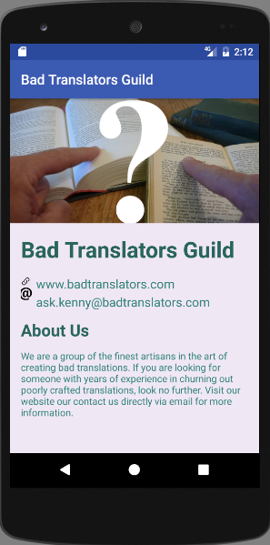

# Bad Translators Guild Android App

This is the final project of the *Android Basics: User Interface* course. It's a single-screen Android app with information about the Bad Translators Guild.

Link to the course: [https://classroom.udacity.com/courses/ud834](https://classroom.udacity.com/courses/ud834)

## Download

Download the app from the [releases page](https://github.com/kenneth-lau/android-single-screen-app/releases).

**Screenshot**

